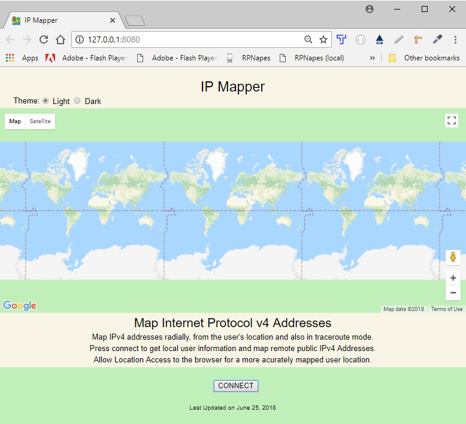
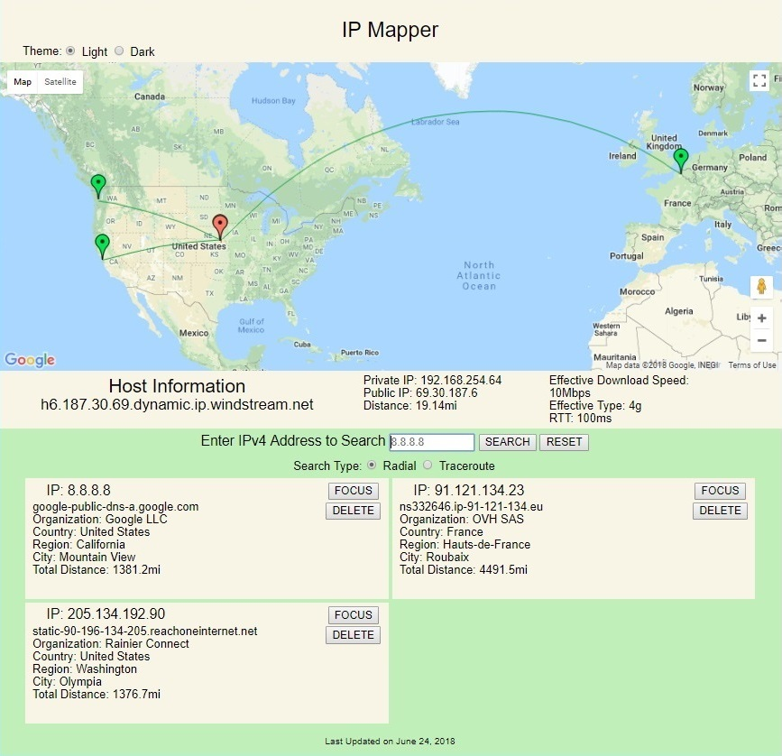
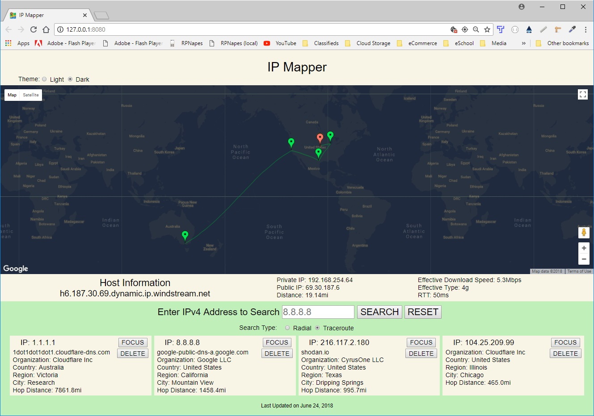

# [IP Mapper](https://napesweaver.github.io/ip-mapper/)

A web application for displaying basic user network information and for mapping the physical location of Internet Protocol version 4 addresses.

Users may enter valid IPv4 dotted-quad addresses and map them either radially (starting from the user's location) or in a traceroute fashion.

## Summary

If supported by the browser, the [Network Information API](https://developer.mozilla.org/en-US/docs/Web/API/Network_Information_API) is used to collect basic user network connection information (download speed, type and Round Trip Time for the current connection) from the Navigator.connection property.

If supported by the browser, [WebRTC API](https://webrtc.org/) is utilized to get the private IP for the user's device.

If Location Access is allowed and the browser supports it, user location is obtained through the [Geolocation API](https://developer.mozilla.org/en-US/docs/Web/API/Geolocation_API) Navigator.geolocation property.

Public IPs, as well as latitude and longitude for the user and for searches, are obtained via [IP API](https://ipapi.co/api/#introduction).

The [SHODAN API](https://developer.shodan.io/) provides the means for getting reverse-domain-names.

Mapping and distance calculations are accomplished using Google Maps JavaScript API. [Google Maps JavaScript API](https://developers.google.com/maps/documentation/javascript/tutorial).

## Screenshots
### Landing Page



### Radial Searching



### Traceroute Searching



## Built With

* HTML

* CSS

* JavaScript

* jQuery

## Example Input Test Data
```
1.1.1.1
1.2.3.4
8.8.8.8
91.121.134.23
104.25.209.99
205.134.192.90
216.117.2.180
```

## Link to IP Mapper
- [IP Mapper](https://napesweaver.github.io/ip-mapper/)

## Acknowledgements
Brandon Hinshaw